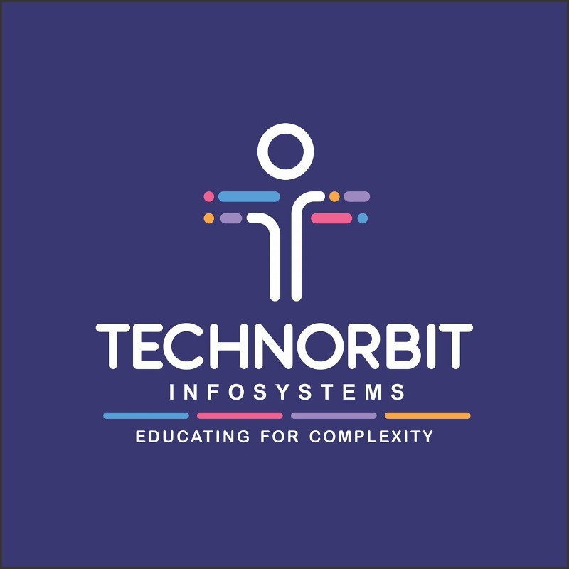

# Coding Journey - TECHNORBIT-INFOSYSTEMS
This repository contains all the coding exercises, assignments, and projects completed during my time at *TECHNORBIT-INFOSYSTEMS*.
 
## Auther-Kiran Tajanpure

## Overview

This repository is a comprehensive collection of all my work throughout the coding classes, organized by each lecture and topic. It demonstrates the breadth of programming concepts covered during the course.

## Image

> (Replace the path above with the actual path or URL of your image)

## Features

- Regularly updated code from each lecture.
- Clear folder structure based on topics and classes.
- Examples include assignments, projects, and coding exercises.
- All code files are well-commented for better understanding.

## Keeping Track of My Coding Journey

This repository serves as a personal log of my progress in coding. Each submission reflects the concepts learned during each lecture and showcases my development as a programmer. By documenting my journey, I aim to:

- *Monitor Growth*: Track my learning over time and identify areas for improvement.
- *Build a Portfolio*: Create a collection of work to showcase my skills to potential employers.
- *Encourage Consistency*: Maintain a habit of coding regularly and documenting my progress.

## Live Demo

You can view a live demo of the code running here: [Live Demo](https://github.com/kiran28092003/Codes)

## Author

*Kiran Tajanpure*  
Student at *Amrutvahini College of Engineering, Sangamner*  
Coding Enthusiast | [LinkedIn](https://www.linkedin.com/in/kiran-tajanpure-a7509225b)

## Contact

For any queries, feel free to reach out via [LinkedIn](https://www.linkedin.com/in/kiran-tajanpure-a7509225b) or email me at kirantajanpure48@gmail.com
